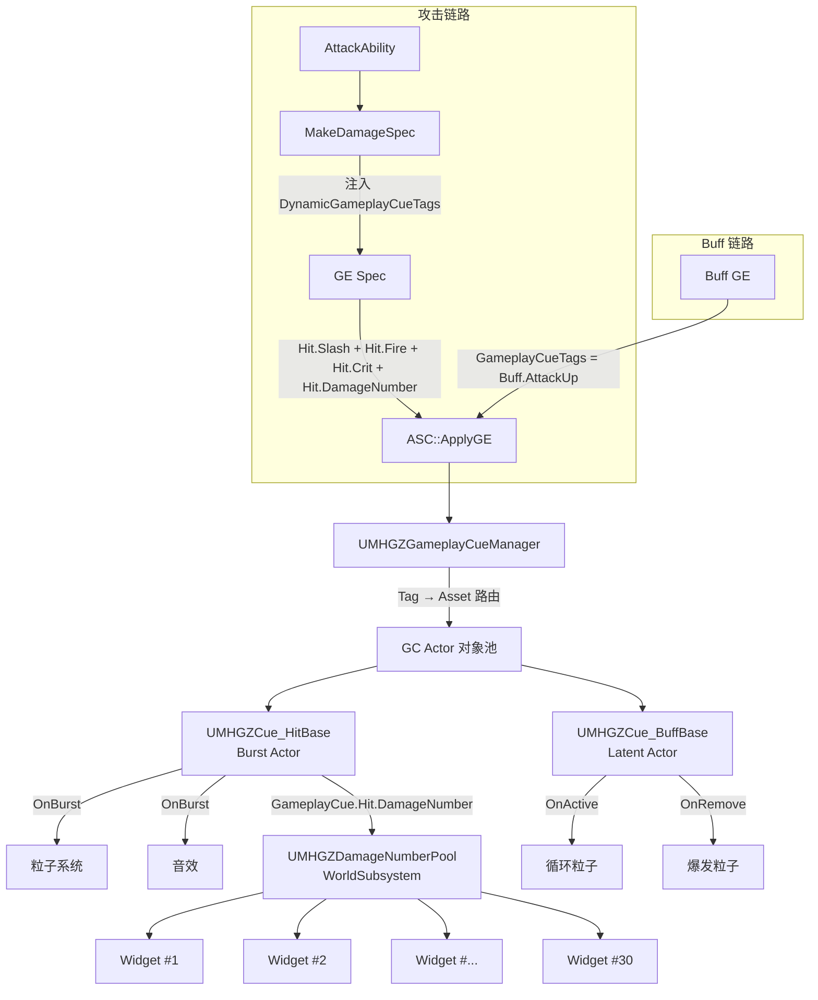

# GameplayCue 系统

> **实施状态说明（以源码、配置和 Content 为准）：** 当前只完成 GameplayCue Tag 注册以及 `+GameplayCueNotifyPaths=/Game/GameplayCues` 配置。源码中没有自定义 GameplayCueManager、Cue 基类或伤害数字对象池，Content 中也没有 GC 资产；攻击代码目前使用 `AddDynamicAssetTag` 保存 Cue Tag，尚未形成 GameplayCue 自动触发链路。本文其余内容全部作为详细实现方案保留。

## 当前实现

| 项目 | 当前状态 |
|------|----------|
| 配置 | `/Game/GameplayCues` 扫描路径已配置；没有 `GlobalGameplayCueManagerClass`。 |
| Tag | Slash/Blunt/Fire/Crit/DamageNumber/Kinsect、IG 三灯反馈、Monster.Roar、Weapon.Trail 等部分 Tag 已注册；本文其他 Tag 是规划。 |
| C++ | `UMHGZGameplayCueManager`、`UMHGZCue_HitBase`、`UMHGZCue_BuffBase`、`UMHGZDamageNumberPool` 均未创建。 |
| 资产 | `Content/GameplayCues` 只有目录占位文件，没有任何 GameplayCueNotify 或伤害数字 Widget。 |
| 模块 | Build.cs 已有 GameplayAbilities/GameplayTags/UMG，尚未添加 Niagara。 |

> **设计原则：** 统一 GameplayCue 标签触发全部命中反馈（火花/音效/震屏/伤害数字）和状态驱动视觉（Buff 光环/死亡/翻滚），按语义分类创建 C++ 基类封装通用逻辑，伤害数字用 WorldSubsystem 管理对象池。

> **适用范围：** 当前版本仅单机。GameplayCue 在单机模式下等价于本地函数调用，零网络开销。

> **与 AnimNotify 的职责边界：** 帧同步 VFX（武器拖尾、脚步声）由 AnimNotify 驱动；状态驱动 VFX（命中反馈、Buff 光环、死亡）由 GameplayCue 驱动；镜头效果由 Ability 内 CameraModifier 管理。三者互补，不重叠。

---

> **设计决策：** 见 [design-decisions.md](design-decisions.md) #99-#103

---

## GameplayCue Tag 目标层级（是否已注册以 DefaultGameplayTags.ini 为准）

### 命中反馈（Execute——瞬时触发）

```
GameplayCue.Hit.Slash           ← 斩击命中火花
GameplayCue.Hit.Blunt           ← 打击命中火花
GameplayCue.Hit.Fire            ← 火属性命中特效
GameplayCue.Hit.Ice             ← 冰属性命中特效
GameplayCue.Hit.Thunder         ← 雷属性命中特效
GameplayCue.Hit.Dragon          ← 龙属性命中特效
GameplayCue.Hit.Crit            ← 暴击命中特效
GameplayCue.Hit.Block           ← 格挡/防御命中特效
GameplayCue.Hit.DamageNumber    ← 伤害数字浮空文字
```

> **触发方式：** 攻击方 `MakeDamageSpec` 将对应 Tag 注入 GE Spec 的 `DynamicGameplayCueTags`，ASC `ApplyGameplayEffectToTarget` 时自动路由。一个 GE Spec 可携带多个 GC Tag（物理+元素+暴击+伤害数字）→ 对应 GC Notify 全部触发。

### Buff/Debuff 视觉（Add/Remove——持续触发）

```
GameplayCue.Buff.AttackUp       ← 攻击力提升光环
GameplayCue.Buff.DefenseUp      ← 防御力提升光环
GameplayCue.Buff.SpeedUp        ← 速度提升光环
GameplayCue.Buff.HealOverTime   ← 持续回复光环
GameplayCue.Buff.ElementResist  ← 属性耐性光环
```

> **触发方式：** Buff GE 的 `GameplayCueTags` 中添加对应 Tag。GE 生效时→`GC.OnActive`（Add）；GE 到期/被移除时→`GC.OnRemove`（Remove）。

### 角色/怪物特效（Execute）

```
GameplayCue.Character.Death     ← 角色死亡特效
GameplayCue.Character.Dodge     ← 翻滚/闪避尘土
GameplayCue.Character.Heal      ← 回复特效
GameplayCue.Monster.Roar        ← 怪物咆哮
GameplayCue.Monster.Death       ← 怪物死亡
GameplayCue.Monster.Stagger     ← 怪物硬直
```

---

## 架构总览（规划）



---

## 基础设施（规划，当前均未创建）

### UMHGZGameplayCueManager — 自定义 GC 管理器

`Source/MHGZ/GameplayCue/MHGZGameplayCueManager.h/.cpp`，继承 `UGameplayCueManager`。

| 成员 | 类型 | 默认值 | 说明 |
|------|------|:--:|------|
| DefaultBurstPoolSize | int32 | 20 | Burst Actor 对象池默认大小 |
| bEnableSurfaceRouting | bool | false | 是否启用物理表面子 Tag 路由 |
| bLogMissingCues | bool | true | 开发期输出未找到 GC Notify 的 Tag 警告 |

| 方法 | 说明 |
|------|------|
| `OnGameplayCueNotifyActorLoaded(AssetPath)` | 覆写——GameplayCueNotify 资产异步加载回调 |
| `RouteGameplayCue(OriginalTag, HitResult)` | 物理表面路由——`Slash` + Wood → `Slash.Wood`。回退规则：子 Tag Notify 不存在→回退到父 Tag；父 Tag 也不存在→静默跳过+日志警告 |
| `ShouldSuppressCue(CueTag, Location)` | 全局裁剪——距相机超 `GlobalCullDistance` 返回 true |
| `GetPooledBurstActor(CueClass)` | 从池获取/创建 Burst Actor（LRU 回收） |
| `DumpPoolStats()` | 调试命令——输出各池的 Active/Idle/Peak 计数 |

**DefaultGame.ini 配置：**

```ini
[/Script/GameplayAbilities.AbilitySystemGlobals]
; 规划：实现类后再启用
GlobalGameplayCueManagerClass=/Script/MHGZ.MHGZGameplayCueManager
+GameplayCueNotifyPaths=/Game/GameplayCues
```

### UMHGZCue_HitBase — 命中特效基类

`Source/MHGZ/GameplayCue/MHGZCue_HitBase.h/.cpp`，继承 `UGameplayCueNotify_Burst`。

| 成员 | 类型 | 默认值 | 说明 |
|------|------|:--:|------|
| bAutoPool | bool | true | 启用 GameplayCueManager 自动对象池 |
| MaxCullDistance | float | 3000 | 距所有玩家相机超此距离不生成粒子 |
| MaxConcurrent | int32 | 10 | 同类型命中特效同时存在的最大数量（超过则回收最早） |
| SoundAttenuation | TObjectPtr\<USoundAttenuation\> | — | 音效衰减设置（按相机距离自动调音量） |
| NiagaraSystem | TObjectPtr\<UNiagaraSystem\> | — | 主粒子系统（蓝图子类配置） |
| HitSound | TObjectPtr\<USoundBase\> | — | 命中音效（蓝图子类配置） |

| 方法 | 说明 |
|------|------|
| `OnBurst(Target, Source, HitResult, Parameters)` | 覆写——1. `CheckDistanceCull` 裁剪；2. `EnforceConcurrencyLimit` 限流+LRU回收；3. Spawn NiagaraSystem at HitLocation, Rotation=ImpactNormal；4. Play HitSound + SoundAttenuation；5. 粒子播完→自动回池 |
| `CheckDistanceCull(Location)` | 遍历 PlayerController 取最近相机距离，> MaxCullDistance 返回 true |
| `EnforceConcurrencyLimit()` | ActiveCount ≥ MaxConcurrent 时回收最早 Burst Actor |
| `GetPooledInstance()` | 从 GameplayCueManager 池获取自身实例（供蓝图 `OnBurst` 覆写转发） |

### UMHGZCue_BuffBase — Buff 光环基类

`Source/MHGZ/GameplayCue/MHGZCue_BuffBase.h/.cpp`，继承 `UGameplayCueNotify_BurstLatent`。

| 成员 | 类型 | 说明 |
|------|------|------|
| SocketName | FName | 挂载骨骼名（默认 `"Root"`） |
| LoopingVFX | TObjectPtr\<UNiagaraSystem\> | 循环粒子系统 |
| ApplySound | TObjectPtr\<USoundBase\> | Buff 应用瞬间音效 |
| RemoveSound | TObjectPtr\<USoundBase\> | Buff 移除瞬间音效 |
| RemoveBurstVFX | TObjectPtr\<UNiagaraSystem\> | 移除时爆发粒子（一次性） |

| 方法 | 说明 |
|------|------|
| `OnActive(Target, Parameters)` | 覆写——1. Spawn LoopingVFX 附加到 Target→GetMesh(), SocketName；2. Play ApplySound |
| `WhileActive(Target, Parameters)` | 覆写——若 Parameters 含 StackCount，更新 Niagara FloatParameter("Intensity", StackCount/MaxStack) |
| `OnRemove(Target, Parameters)` | 覆写——1. Play RemoveSound；2. Spawn RemoveBurstVFX at Target.Location；3. Destroy LoopingVFX 组件 |
| `GetAttachSocketName()` | BlueprintPure——返回 SocketName，供蓝图覆写动态选择骨骼 |

### UMHGZDamageNumberPool — 伤害数字对象池

`Source/MHGZ/GameplayCue/MHGZDamageNumberPool.h/.cpp`，继承 `UWorldSubsystem`。

| 成员 | 类型 | 默认值 | 说明 |
|------|------|:--:|------|
| PoolSize | int32 | 30 | 预分配 Widget 数量 |
| WidgetClass | TSubclassOf\<UUserWidget\> | WBP_DamageNumber | 浮空文字 Widget 类 |
| FloatOffset | FVector | (0,0,80) | Widget 生成位置相对命中点的偏移 |
| FloatDuration | float | 1.5 | 上浮+淡出动画总时长 |

| 方法 | 说明 |
|------|------|
| `Initialize(Collection)` | 覆写——预分配 PoolSize 个 UWidgetComponent，全部 Hidden+CollisionDisabled，加入空闲池 |
| `Deinitialize()` | 覆写——遍历使用中+空闲池，全部 DestroyComponent |
| `AcquireWidget()` | 从空闲池 Pop→SetHidden(false)→加入使用池→返回。池空返回 nullptr |
| `ReleaseWidget(Widget)` | 从使用池 Remove→SetHidden(true)→加入空闲池。由动画完成回调调用 |
| `GetActiveCount()` | BlueprintPure——返回使用池大小，调试用 |

**由 GC_Hit_DamageNumber 驱动：**

```
OnBurst(Parameters)
  1. DamageValue = Parameters.RawMagnitude
  2. bCrit = Parameters.GameplayCueTags.HasTag(Hit.Crit)
  3. Widget = DamageNumberPool→AcquireWidget()
  4. 若 nullptr → return（池耗尽，静默丢弃）
  5. 设数值/暴击颜色/字号 → AttachToActor(Target) → SetLocation(HitLocation + FloatOffset)
  6. PlayAnimation(上浮+淡出, FloatDuration) → 回调 ReleaseWidget
```

> **池耗尽策略：** 不增长、不阻塞、不崩溃。30 个 Widget 足以覆盖最密集的攻击场景（双刀乱舞 4 段 × 7 跳 = 28 并发，仍在池内）。

---

> **攻击链路集成（FAttackDamageConfig 扩展 + MakeDamageSpec 修改）：** 见 [actions.md](actions.md) 中"核心配置结构"与"GameplayCue 集成 — MakeDamageSpec"段。ApplyDamage 现有链路零改动。

---

## Buff/Debuff 视觉集成（规划）

### Buff GE 配置

每个 Buff GE 蓝图需在 `GameplayCueTags` 中添加对应 Tag：

| Buff | GE 蓝图 | GameplayCueTag | Duration Policy |
|------|---------|----------------|:--:|
| 攻击力↑ | GE_Buff_AttackUp | `GameplayCue.Buff.AttackUp` | HasDuration |
| 防御力↑ | GE_Buff_DefenseUp | `GameplayCue.Buff.DefenseUp` | HasDuration |
| 速度↑ | GE_Buff_SpeedUp | `GameplayCue.Buff.SpeedUp` | HasDuration |
| 持续回复 | GE_Buff_HealOverTime | `GameplayCue.Buff.HealOverTime` | HasDuration |
| 属性耐性 | GE_Buff_ElementResist | `GameplayCue.Buff.ElementResist` | HasDuration |

> **Trigger 自动路由：** Duration GE 激活→ASC 自动调用 GC Notify 的 `OnActive`；GE 到期或被 `RemoveActiveEffects` 移除→`OnRemove`。无需手动调用 Execute/Add/Remove。

---

> **目录结构：** 见 [directory-structure.md](directory-structure.md) 中 `GameplayCue/` 与 `Content/GameplayCues/` 段

---

> **验证方案：** 见 [verification.md](verification.md) #60-#70

---

## Build.cs 目标模块依赖（Niagara 当前尚未添加）

在 `Source/MHGZ/MHGZ.Build.cs` 中确认/新增：

```cpp
PublicDependencyModuleNames.AddRange(new string[] {
    "GameplayAbilities",   // UGameplayCueManager, UGameplayCueNotify_Burst, UGameplayCueNotify_BurstLatent
    "GameplayTags",        // FGameplayTag, FGameplayTagContainer
    "Niagara",             // UNiagaraSystem（GameplayCue 粒子系统）
    "UMG"                  // UUserWidget, UWidgetComponent（伤害数字）
});
```

---

## 排除范围

| 排除项 | 原因 | 归属 |
|--------|------|------|
| 武器拖尾 | 帧精确动画同步 | AnimNotify 直接驱动 TrailComponent |
| 镜头震动 | 独立系统 | Ability 内 CameraModifier（设计决策 #39） |
| 脚步声 | 帧精确动画同步 | AnimNotify |
| 环境交互特效 | 属交互系统范畴 | 后续独立设计 |
| MetaSound vs SoundCue | 音效资产选型 | 音效管理范畴（pending.md 标记） |
| 网络复制 | 当前仅单机 | 后续版本补充 |
